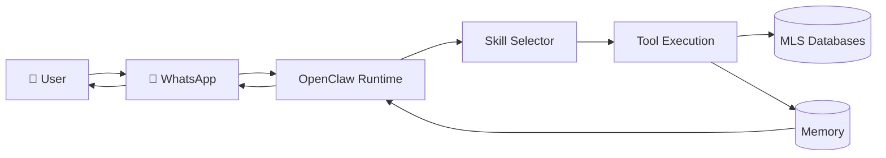

# IDX Exchange — Agentic AI Track · Summer 2026

OpenClaw-powered multi-agent system for IDX Exchange, integrating WhatsApp messaging with MLS database skills.

**Team:** monKeypas

---

## Week 1 Deliverable

📄 **[OpenClaw Architecture Fundamentals](docs/week-1-openclaw-architecture.md)**

Architecture documentation with workflow diagrams showing how user queries flow from WhatsApp through OpenClaw skills to MLS databases.

### Quick Architecture Overview



---

## Week 2 Deliverable

📄 **Natural Language Property Search** — `skills/property-search/`

OpenClaw skill that parses free-text real estate queries into structured filter objects for `rets_property`.

```bash
npm install
npm test
npm run parse -- "Show me 3-bedroom condos in Irvine under $1.5M with a pool."
```

---

## Repository Structure

```
├── docs/
│   └── week-1-openclaw-architecture.md   # Week 1 deliverable
├── skills/
│   └── property-search/                # Week 2 OpenClaw skill
├── src/
│   └── parsePropertyQuery.ts             # NLP parser + rets_property mapping
├── tests/
│   └── parsePropertyQuery.test.ts        # 12 validation queries
├── config/
│   └── openclaw.json.example             # Sanitized OpenClaw config template
├── AGENTS.md                             # Agent behavior and routing rules
├── SOUL.md                               # Agent personality and boundaries
├── IDENTITY.md                           # Agent identity
├── USER.md                               # Human context
├── TOOLS.md                              # Environment-specific tool notes
└── HEARTBEAT.md                          # Periodic check-in prompts
```

---

## OpenClaw Workspace

This repo doubles as the OpenClaw agent workspace. To restore on a new machine:

```bash
git clone https://github.com/monKeypas/IDX-Exchange-Agentic-AI-Track-Summer-2026.git ~/.openclaw/workspace
cp ~/.openclaw/workspace/config/openclaw.json.example ~/.openclaw/openclaw.json
# Edit openclaw.json with your API keys and tokens, then:
openclaw onboard
```

### Kept Local (not in git)

- `~/.openclaw/credentials/` — WhatsApp and channel auth
- `~/.openclaw/openclaw.json` — live config with secrets
- `~/.openclaw/agents/*/sessions/` — conversation history

---

## License

Course project — IDX Exchange Agentic AI Track, Summer 2026.
