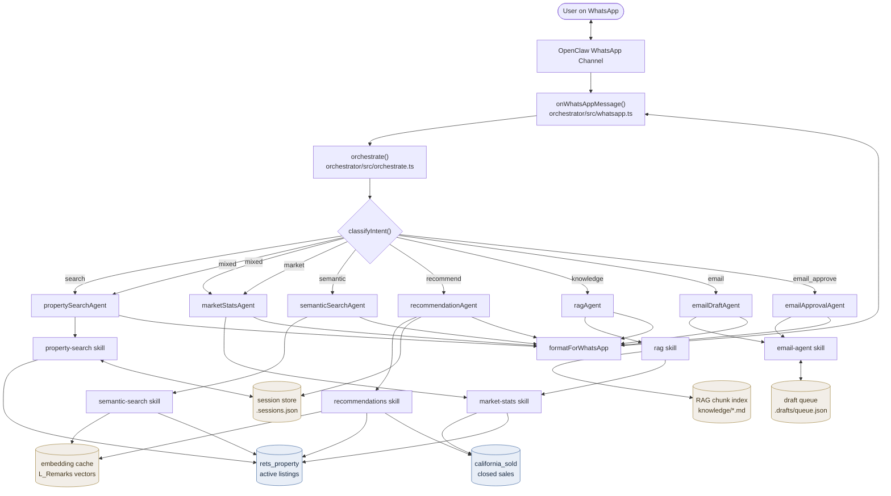
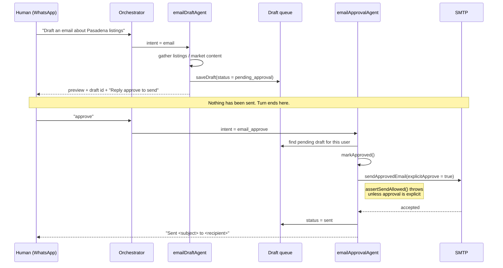

# Capstone Architecture — IDX Multi-Agent Real Estate Assistant

**IDX Exchange · Agentic AI Track · Summer 2026 · Team monKeypas**

As-built architecture of the delivered system. (The Week 1 diagram in
[week-1-openclaw-architecture.md](week-1-openclaw-architecture.md) was the original plan;
this one reflects what actually shipped, including the agents and safety gate added in
Weeks 6–11.)

---

## Full multi-agent flow

Both databases are reachable from the single WhatsApp entry point, and a mixed-intent
query fans out to `propertySearchAgent` and `marketStatsAgent` in parallel
(`Promise.all`), hitting `rets_property` and `california_sold` on one turn.

---

## The email approval gate

The one flow that deliberately **cannot** complete in a single turn. No email is ever sent
without a human typing an approval first — not from a draft turn, not from a heartbeat,
not from any autonomous path.

Enforcement lives in `email-agent/src/guardrails.ts`:

- `assertSendAllowed()` throws unless `explicitApprove` is true **and** the draft is in an
  approvable state — the send path cannot be reached by accident.
- `clampRows()` caps any result set at 50 rows, so an email can never bulk-export MLS data.
- `redactSecrets()` / `safeLog()` strip credentials from every log and preview.

---

## Intent routing

| Intent | Trigger | Agent | Data |
|---|---|---|---|
| `search` | Structured filters — beds, baths, price, city, amenities | `propertySearchAgent` | `rets_property` |
| `market` | Trends, DOM, median, inventory, "good time to buy" | `marketStatsAgent` | `california_sold` (+ active counts) |
| `mixed` | Search **and** market signals in one message | both, in parallel | both tables |
| `semantic` | Descriptive prose with no structured filters | `semanticSearchAgent` | `L_Remarks` embeddings |
| `recommend` | "similar", "I like X" | `recommendationAgent` | `rets_property` + `california_sold` comps |
| `knowledge` | "what does/is", definitions, disclosures | `ragAgent` | indexed docs + live market chunk |
| `email` | "draft", "email", "send me a summary" | `emailDraftAgent` | draft queue |
| `email_approve` | "approve", "send it" | `emailApprovalAgent` | draft queue → SMTP |

Routing precedence is ordered so approval is checked before drafting (an approval acts on
an existing draft and never creates one), structured search beats descriptive search when
filters are present, and a leading "what does/is" suppresses the market match so
definitional questions reach RAG. Pinned by `orchestrator/tests/orchestrate.test.ts`.

---

## Component map

| Layer | Location |
|---|---|
| WhatsApp channel | OpenClaw plugin, configured in `openclaw/config/openclaw.json.example` |
| Message handler | `orchestrator/src/whatsapp.ts` |
| Coordinator | `orchestrator/src/orchestrate.ts`, `classifyIntent.ts`, `agents.ts` |
| Skills | `openclaw/workspace/skills/{property-search,market-stats,semantic-search,recommendations,rag,email-agent}/` |
| Data access | One pooled, parameterized `query()` per skill (`src/mysql.ts`) |
| Agent context | `openclaw/workspace/*.md` + each skill's `SKILL.md` |

Skills are reachable two ways: the OpenClaw agent reads `SKILL.md` and shells out to the
matching `npm run` script, while the orchestrator imports each skill's `src/` directly.
Field-level notes on both tables are in [schema-annotation.md](schema-annotation.md).
