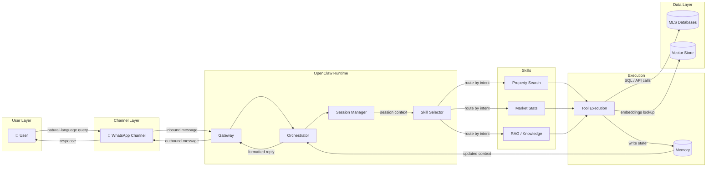
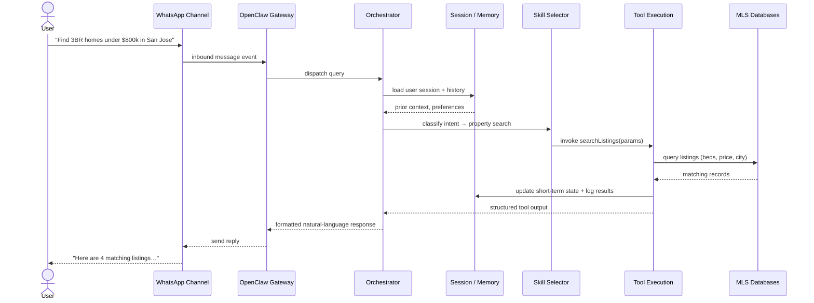
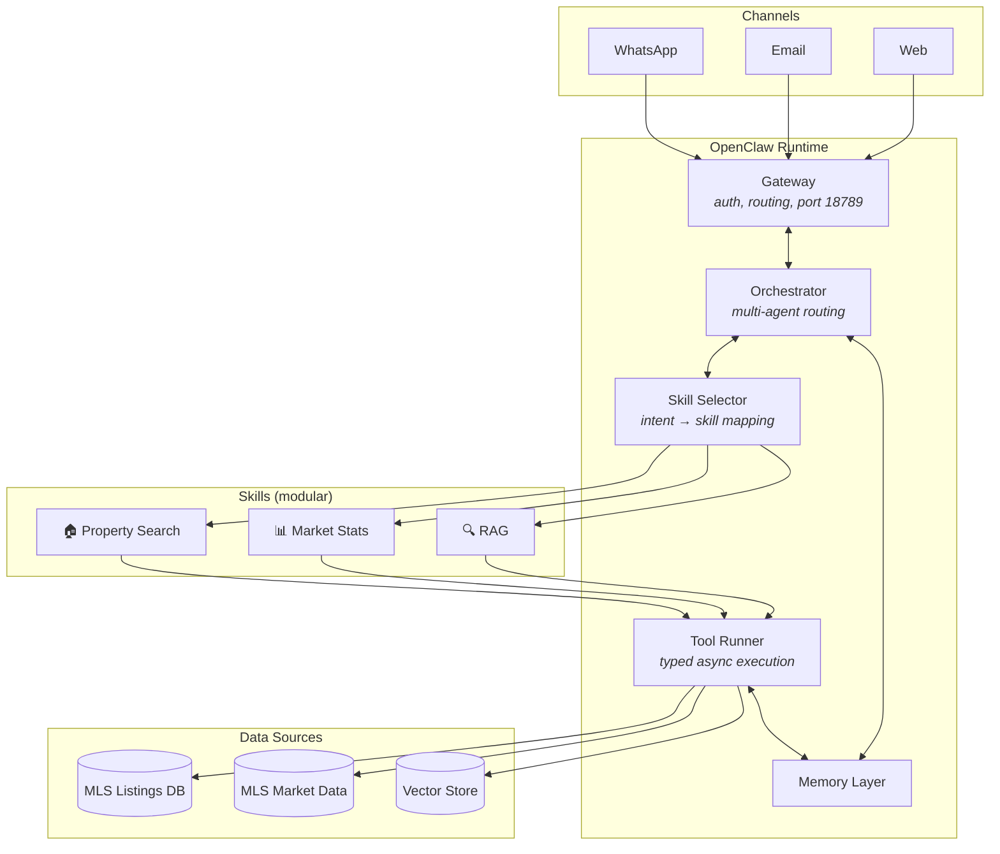
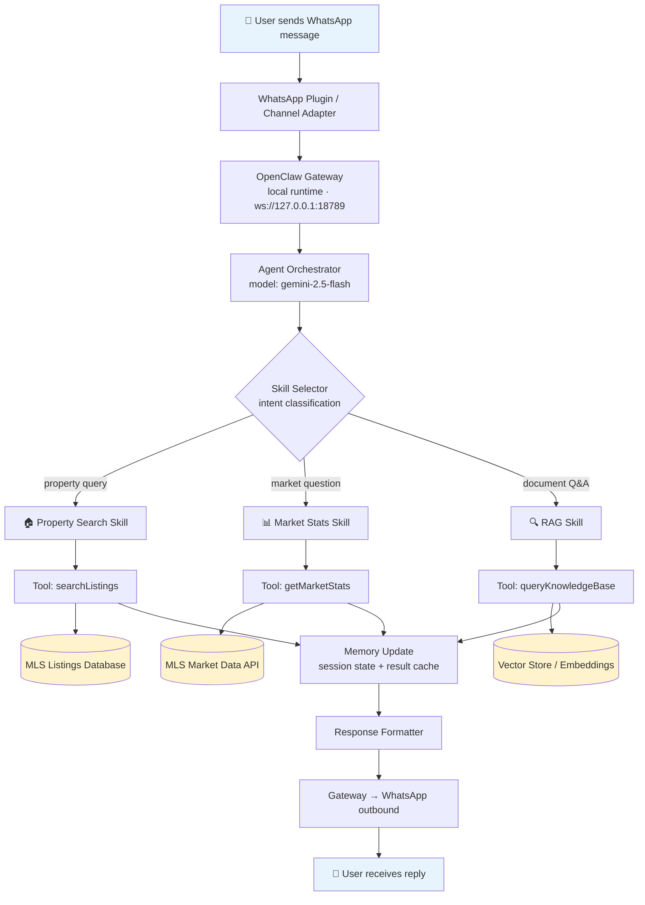

# Week 1 Deliverable — OpenClaw Architecture Fundamentals

**IDX Exchange · Agentic AI Track · Summer 2026**

---

## Overview

OpenClaw is a multi-agent orchestration runtime that handles skill routing, session state, channel integration, and tool execution. Understanding how these pieces interact is the foundation for every subsequent week of this track.

In our IDX Exchange use case, a real estate agent or buyer sends a natural-language query over WhatsApp (e.g., *"Show me 3-bed homes under $800k in San Jose"*). OpenClaw receives the message, routes it to the right skill, executes tools against MLS databases, updates memory, and returns a structured response — all within a single conversational turn.

---

## Architecture Flow

### High-Level Request Lifecycle



### End-to-End Sequence



### Simplified Linear Flow

```
User → WhatsApp → OpenClaw Runtime → Skill Selector → Tool Execution → Memory Update → Response → User
                                              ↓
                                        MLS Databases
```

---

## Key Components

| Component | Role | IDX Exchange Example |
|-----------|------|----------------------|
| **Skills** | Modular capability units the orchestrator can invoke | Property search, market stats, RAG over listing docs |
| **Channels** | Communication interfaces between users and the runtime | WhatsApp (primary), email, web UI |
| **Sessions** | Per-user conversation state and short-term memory | Buyer preferences, last search filters, follow-up context |
| **Tools** | Typed async functions the agent can call | `searchListings()`, `getMarketStats()`, `getCurrentTime()` |
| **Memory** | Short-term session state + long-term vector storage | Session history in OpenClaw; embeddings in vector DB for RAG |
| **Orchestrator** | Routes queries to the correct skill/agent | Intent classification → property search vs. market stats vs. general Q&A |

---

## Component Interaction Detail



---

## Basic Tool Definition

Tools are plain async functions registered with the runtime. The orchestrator calls them when a skill needs external data or side effects.

```typescript
export async function getCurrentTime() {
  return { currentTime: new Date().toISOString() };
}

export async function searchListings(params: {
  city: string;
  minBeds: number;
  maxPrice: number;
}) {
  // Tool execution layer — queries MLS database
  const results = await mlsClient.query({
    city: params.city,
    bedrooms: { gte: params.minBeds },
    price: { lte: params.maxPrice },
  });
  return { listings: results, count: results.length };
}

export async function handleMessage(message: string) {
  if (message.toLowerCase().includes("time")) {
    return await getCurrentTime();
  }

  if (message.toLowerCase().includes("home") || message.toLowerCase().includes("listing")) {
    return await searchListings({
      city: "San Jose",
      minBeds: 3,
      maxPrice: 800_000,
    });
  }

  return { response: "I could not understand the request." };
}
```

---

## WhatsApp → MLS Data Path (IDX Exchange)

This diagram shows the specific path required for the Week 1 deliverable: how a user query on WhatsApp reaches MLS-backed skills.



---

## Design Principles

1. **Separation of concerns** — Channels handle transport; skills handle domain logic; tools handle data access.
2. **Session-scoped memory** — Each user maintains isolated conversation state (`dmScope: per-channel-peer`).
3. **Skill modularity** — New capabilities (e.g., mortgage calculator, showing scheduler) plug in without changing the orchestrator.
4. **Typed tool contracts** — Tools return structured JSON so the model can reason over results reliably.
5. **Fail-safe routing** — Unrecognized intents fall back to a default response rather than executing the wrong skill.

---

## Local Setup Reference

This repository contains the OpenClaw agent workspace used in the architecture above:

| File | Purpose |
|------|---------|
| `AGENTS.md` | Agent behavior and routing rules |
| `config/openclaw.json.example` | Gateway, WhatsApp channel, and model config template |
| `IDENTITY.md` / `SOUL.md` | Agent persona and boundaries |

See the [repository README](../README.md) for clone and restore instructions.

---

## Summary

OpenClaw acts as the orchestration layer between conversational channels (WhatsApp) and backend data systems (MLS databases). The runtime receives a user message, loads session context, routes to the appropriate skill, executes typed tools against MLS APIs, persists updated memory, and returns a natural-language response — completing the full loop from user query to data-backed answer.
