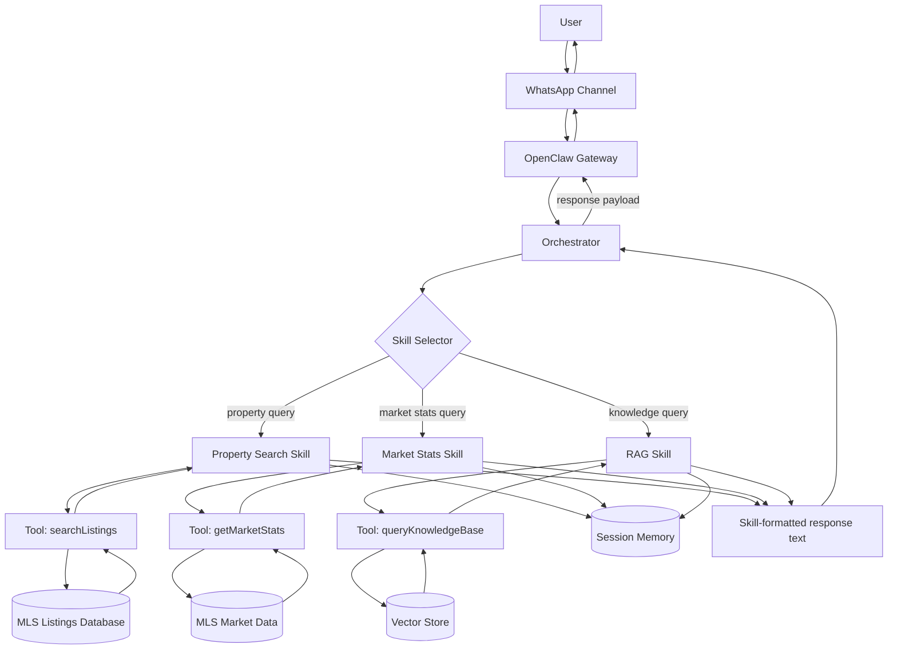

# Week 1 Deliverable — OpenClaw Architecture Fundamentals

**IDX Exchange · Agentic AI Track · Summer 2026**

## Architecture Documentation

This document describes how user queries flow from WhatsApp through OpenClaw skills to MLS databases, then back to the user.

### Workflow Diagram (Single Source of Truth)

## Key Points

- OpenClaw routes incoming WhatsApp messages using the orchestrator and skill selector.
- Skills call tools to fetch raw data from MLS data sources.
- Tool output returns to the active skill, not directly to memory or gateway.
- The active skill updates memory and formats the final user-facing text.
- The orchestrator forwards the skill response payload to gateway/channel for delivery.
