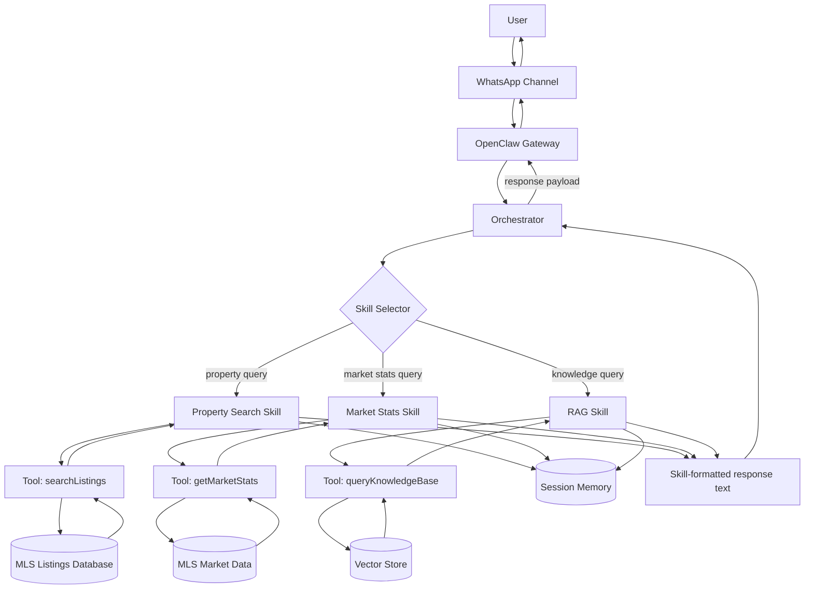

# Week 1 Deliverable — OpenClaw Architecture Fundamentals

**IDX Exchange · Agentic AI Track · Summer 2026**

## Architecture Documentation

This document describes how user queries flow from WhatsApp through OpenClaw skills to MLS databases, then back to the user.

### Workflow Diagram (Single Source of Truth)

## Component Roles

- **User (`U`)**: The human sending natural-language real estate queries (e.g., price range, city, bedroom count).
- **WhatsApp Channel (`WA`)**: Messaging surface that delivers raw messages and metadata into OpenClaw, and carries responses back to the user.
- **OpenClaw Gateway (`GW`)**: Entry/exit point of the runtime; normalizes channel events into a standard request shape and sends response payloads back out.
- **Orchestrator (`ORCH`)**: Core coordination layer that receives normalized requests, loads context, calls the skill selector, and forwards final skill responses back to the gateway.
- **Skill Selector (`SS`)**: Lightweight classifier that inspects the request (and sometimes history) to choose which skill should own this turn (property search, market stats, or RAG).
- **Property Search Skill (`SK1`)**: Domain-specific logic for listing search; converts natural language into structured filters and calls `searchListings`.
- **Market Stats Skill (`SK2`)**: Computes or retrieves aggregate stats (median price, days on market, etc.) by calling `getMarketStats`.
- **RAG Skill (`SK3`)**: Handles knowledge/retrieval-style questions by querying a vector store with `queryKnowledgeBase`.
- **Tools (`T1`, `T2`, `T3`)**: Typed async functions that translate skill intents into concrete MLS/DB/API calls and return structured JSON results.
- **MLS Data Sources (`MLS1`, `MLS2`)**: Backing MLS systems that store raw listing records and market data queried by the tools.
- **Vector Store (`VDB`)**: Embedding-backed store used by the RAG skill to retrieve semantically similar documents or snippets.
- **Session Memory (`MEM`)**: Per-user state (preferences, last filters, recent results) that skills update each turn so future routing and responses can stay contextual.
- **Skill-formatted Response (`RESP`)**: The fully formatted, human-readable message produced by the active skill, which the orchestrator simply forwards to the gateway/channel.
