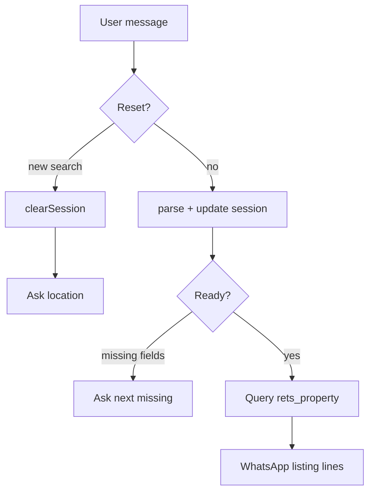

# Week 4 Deliverable — Conversational Property Search

**IDX Exchange · Agentic AI Track · Summer 2026**

## Overview

Multi-turn WhatsApp / CLI search that progressively refines filters, remembers per-user session state, queries `rets_property`, and returns active listings with **address, price, beds/baths, and photo count**.

Builds on **Week 2** parsing and **Week 3** MySQL search.

## Deliverable

| Requirement | Implementation |
| --- | --- |
| Multi-turn conversation | `session.ts` + `chat-turn.ts` |
| Progressive refinement | Session merges prefs each turn |
| Session memory | `session.ts` (memory + `.sessions.json`) |
| `rets_property` results | `searchActiveListings` |
| Address, price, beds/baths, photo count | `formatListingResults` |

### Search readiness

Runs when the session has:

1. **Location** — city or zip
2. **Budget** — min and/or max price
3. **At least one preference** — type, beds/baths, amenities, keywords, etc.

Ask only for the next missing field; accept several preferences in one message.

### Flow



## How to Run

Same `.env` as Week 3. Chat scripts load it automatically.

```bash
npm install
npm test

npm run chat -- --user alice "Find homes in Irvine"
npm run chat -- --user alice "Under $1.2M"
npm run chat -- --user alice "Single family with at least 3 beds"
npm run chat -- --user alice "new search"
```

**WhatsApp:** point OpenClaw at this repo’s `openclaw/workspace/`. On each property message, from the project root:

```bash
npm run chat -- --user "<peerId>" "<message>"
```

Relay stdout to WhatsApp (do not invent listings). Use the same `--user` per peer.

## Key Files

| File | Role |
| --- | --- |
| `src/session.ts` | Session memory + multi-turn handler + listing formatter |
| `src/parsePropertyQuery.ts` | NLP parser (expanded filters) |
| `src/mlsSearch.ts` | Active listing queries |
| `scripts/chat-turn.ts` | CLI / WhatsApp entrypoint |
| `tests/session.test.ts` | Session + formatting tests |

## Notes

- Conversational flow uses **active listings only**; sold comps remain a Week 3 one-shot toggle.
- `PhotoCount` is the MLS photo-count column shown as `N photos`.
- `.sessions.json` is gitignored local state.
- Expanded filters (zip, price ranges, garage, year built, keywords, HOA, etc.) sit on top of the handbook minimum so searches are more practical.
