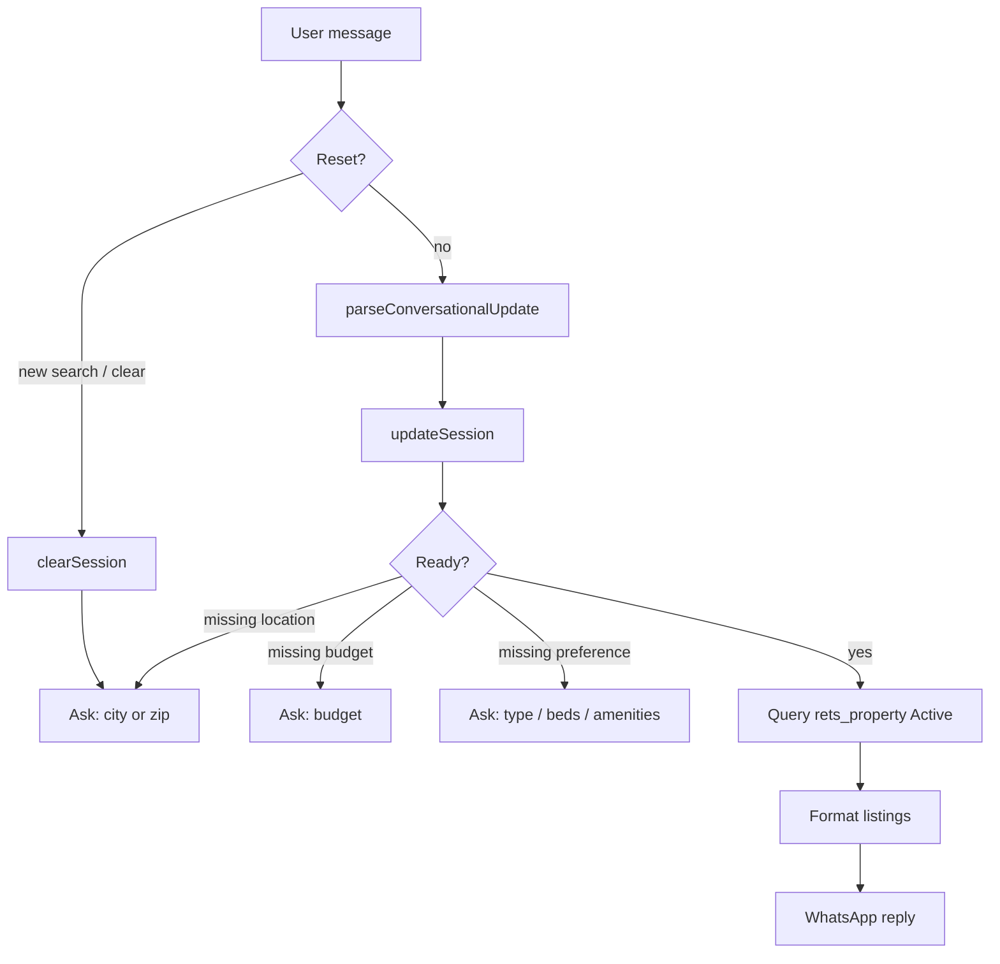

# Week 4 Deliverable — Conversational Property Search

**IDX Exchange · Agentic AI Track · Summer 2026**

## Overview

Multi-turn WhatsApp (and CLI) search that progressively refines filters, remembers per-user session state, queries `rets_property`, and returns active listings with **address, price, beds/baths, and photo count**.

This builds on:

- **Week 2** — natural-language → structured filters
- **Week 3** — parameterized MySQL search + property cards

## Deliverable Checklist

| Requirement | Implementation |
| --- | --- |
| Multi-turn conversation | `conversation.ts` + `chat-turn.ts` |
| Progressive refinement | Session merges new prefs each turn |
| Session memory | `session.ts` (in-memory + `.sessions.json`) |
| `rets_property` results | `searchActiveListings` / `mlsSearch.ts` |
| Address, price, beds/baths, photo count | `formatListingResults` |

## Conversation Flow



### Search readiness

A search runs when the session has:

1. **Location** — `city` **or** `zip`
2. **Budget** — `minPrice` and/or `maxPrice`
3. **At least one preference** — type, beds/baths, sqft, pool/garage/view, year built, keywords, HOA, school district, etc.

Ask only for the next missing field. Accept several preferences in one message.

### Example turn sequence

```text
User: Find homes in Irvine
Agent: Got it (city=Irvine). What is your budget?

User: Under $1.2M
Agent: Got it (...). Any preferences — type, beds/baths, ...?

User: Single family with at least 3 beds
Agent:
  Searching active listings for: city=Irvine, max=$1,200,000, ...
  1) 123 Main St, Irvine, 92618
     $1,100,000 · 3 bd / 2 ba · 18 photos
  ...
```

## Architecture

```
WhatsApp message
  → OpenClaw agent (reads SKILL.md / AGENTS.md)
  → npm run chat -- --user <peerId> "<message>"
  → handleConversationTurn
       → parsePropertyQuery / parseConversationalUpdate
       → session (get / update / clear)
       → searchActiveListings (rets_property)
       → formatListingResults (address, price, beds/baths, PhotoCount)
  → stdout relayed back to WhatsApp
```

| File | Role |
| --- | --- |
| `src/session.ts` | Per-user session memory (`UserSession`) |
| `src/conversation.ts` | Readiness, missing questions, listing formatter |
| `src/propertyFilters.ts` | Shared filter model + SQL WHERE clauses |
| `src/parsePropertyQuery.ts` | NLP parser (expanded Week 4 filters) |
| `src/mlsSearch.ts` | Active listing queries + cards |
| `src/config.ts` | `INCLUDE_SOLD_COMPS` (Week 3 one-shot only) |
| `src/loadEnv.ts` | Loads project-root `.env` for scripts |
| `scripts/chat-turn.ts` | CLI / WhatsApp turn entrypoint |

## Expanded Filters (beyond handbook minimum)

Practical filters mapped to real `rets_property` columns:

- Location: city, zip, county, subdivision, state
- Price: min / max, including `between $2.5M and $3M`
- Size: beds (min / exact), baths, living sqft, lot sqft
- Type: condo, townhome, single family, land, duplex
- Year: built after/before, new construction
- Amenities: pool, view, fireplace, garage, spa, attached garage
- Other: max HOA, school district, days on market, keywords (waterfront / river / lake / golf via remarks + feature text)

## How to Run

**Prerequisites:** MySQL with `idx_exchange`, project-root `.env` (same as Week 3).

```bash
npm install
npm test

# Multi-turn CLI (simulates one WhatsApp peer)
npm run chat -- --user alice "Find homes in Irvine"
npm run chat -- --user alice "Under $1.2M"
npm run chat -- --user alice "Single family with at least 3 beds"
npm run chat -- --user alice "new search"
```

`chat-turn.ts` loads `.env` automatically — no need to `source .env` from the OpenClaw workspace folder.

### Live WhatsApp

1. Point OpenClaw `workspace` at this repo’s `openclaw/workspace/`.
2. On each property message, run from the **git project root**:

```bash
npm run chat -- --user "<WHATSAPP_PEER_ID>" "<USER_MESSAGE_TEXT>"
```

3. Send script stdout back to WhatsApp (do not invent listings).
4. Use the same `--user` id per peer so session memory sticks.

## Notes

- Conversational flow returns **active listings only** (sold comps stay optional for `npm run search:mls` via `INCLUDE_SOLD_COMPS`).
- Photo count is the MLS `PhotoCount` column — how many listing photos that property has.
- Session store `.sessions.json` is gitignored (local per-machine state).
- Gemini free-tier quota can block WhatsApp agent replies even when the skill/DB layer works; CLI chat still works for demos.
